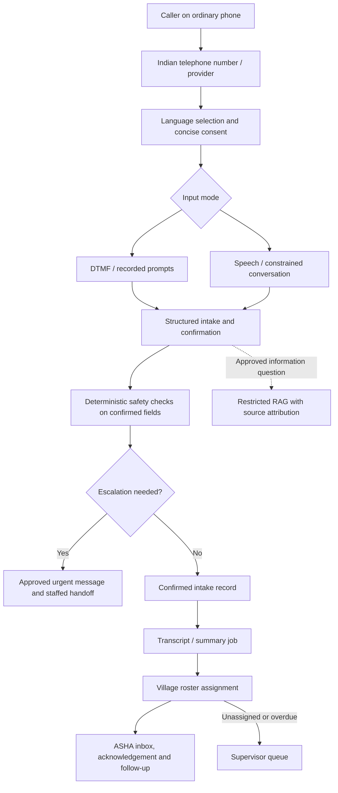

# Stabilization review and next-capability decision checkpoint

Review date: 5 September 2026. Stage 2 is a proposal only. No telephone integration, speech recognition service, LLM, knowledge ingestion, worker inbox, notification provider, or background queue has been implemented by this review.

## 1. Current app status

The existing architecture is usable as a prototype baseline after the fixes below. This is not clinical validation or approval for use with real households. Android airplane-mode, location-permission, audio, and force-quit acceptance still require a physical device.

| Area | What existed / failed | Stabilization result |
|---|---|---|
| Decision engine | Implemented, deterministic, zero dependencies | Preserved all rules, thresholds, types and protected tests; 126 core tests and 13 scenario checks pass |
| Citizen flow | Patient and symptom entry worked; follow-up screen falsely said no questions were needed | Tap and existing spoken flows now collect the answer fields used by the current rules; emergency red flags bypass remaining questions; lower-tier red flags continue screening; save errors offer retry |
| Facility routing | Shared ranking worked; screen used a fixed Nalanda coordinate as the person's origin | Screen uses a permitted device location or an explicitly selected cached village before ranking and labels demo records/simulated evidence; no fixed origin is presented as the person's location |
| Travel tables | Script already existed but generated only estimates; wrong default district and empty datasets could produce misleading success | Default aligned to 227; empty district fails; 300 ESTIMATED rows generated in the isolated test district. OSRM road-network precomputation remains unfinished |
| ASHA visits | Durable local writes, listing and server upsert existed | Upserts cannot overwrite another worker's visit or move its village; writes require the worker's district and active account |
| Sync backend | Ledger and services threw NOT_IMPLEMENTED; routes were absent | Implemented independent transactional operations, concurrent replay locking, ownership checks, fingerprint rejection, conflict replay, server re-evaluation, and district-scoped reference pagination |
| Sync mobile | Missing visit entityVersion; fixed device ID; incorrect coordinate field mapping; deleted payload before clearing pending; ignored conflicts and page boundaries | Stable installation ID, correct envelopes/mapping, guarded acknowledgements, version-aware pending flags, startup recovery, retained rejections/conflicts, backoff, push before pull, and watermark only after all pages save |
| Triage history | Stored server decision only, despite plan requiring both decisions | Additive migration 011 stores client and server result snapshots; older NULL snapshots remain honest |
| Error handling / privacy | Raw validation/SQL errors could reach logs and development responses; query strings entered request logs | Errors use fixed public fallback text, logs omit raw error details and URL query strings; unrestricted forwarded-IP trust disabled |
| Setup / verification | Scenario command missing; mobile omitted from verify; stale env names; example signing secret; legacy test account missing | Verification includes scenarios, mobile typecheck and SQLite tests; corrected environment examples; explicit isolated test fixture preparation |
| RAG | Empty guideline tables and public 501 seam | Preserved; /health always reports ragEnabled=false |

Evidence collected:

- Both TypeScript checks pass.
- Core: 126 passed. Clinical scenarios: 13 checks passed, covering 10 immutable encounter fixtures.
- SQLite outbox: 5 regression checks passed using actual SQLite and the production DAO with an adapter replacing Expo. This does not simulate Android process death or prove Expo transaction durability.
- API suite against an isolated seeded PostgreSQL database: 29 passed, 18 skipped, zero failures. Four of the passing tests are new live integration cases covering concurrent replay, mixed operations, ownership/version conflicts and reference pagination.
- The 18 skips are a pre-existing test-registration defect: facilities.test.ts and sync.test.ts compute skip() before their before hook sets dbUp. Those files are marked COMPLETE and were preserved. Their skipped results are not claimed as coverage; supplemental integration tests exercise the critical sync paths directly.
- All 11 SQL migrations applied, including successful PostGIS and pgvector extension creation. Existing migrations were not edited.
- Isolated seed: 25 villages, 12 facilities. Precomputation: 300 estimated pairs. Seed provenance was read, not independently authenticated against the source records. Seed-generated freshness reports are demonstration data, not field observations.
- Android production export, including Hermes bytecode and the schema.sql asset, succeeded. Expo Go/device operation still needs manual acceptance.
- A listening API returned HTTP 200 from /health with database=up and ragEnabled=false.
- Secret scan passed. No dependency upgrades or major architecture rewrites were introduced.

The original working tree already contained substantial edits. They were preserved. Migration 011 was applied only to the isolated test database; run the normal migration command for each real development deployment before running this revision.

Remaining prototype limitations: no clinical review; no reliable proof of facility source accuracy; no road-network travel calculation; public initial facility bootstrap still targets the demo district; no reference-data deletion/tombstone protocol; village reference rows lack update timestamps and are resent; native force-quit testing pending; no token rotation/revocation, comprehensive audit trail, production transport deployment, or consent/retention policy. Cross-worker local databases are not implemented; the client restricts an installation to its previously signed-in worker to prevent mixing records.

## 2. Existing architecture after stabilization

Expo/React Native calls the same dependency-free packages/core decision and facility-ranking engines as Fastify. SQLite stores local reports, household visits, facility references and an outbox. Authentication tokens use SecureStore. Citizen triage remains accessible without sign-in. ASHA networking requires a session, while local capture can work offline.

Fastify routes handle HTTP; services handle decisions; repositories issue parameterized SQL. PostgreSQL/PostGIS stores minimal encounter snapshots, ASHA visits, facility evidence, travel tables and the sync ledger. Reference pull excludes patient records. The knowledge seam contains guideline_documents and guideline_chunks with vector(768); these are empty and the dimension is explicitly undecided.

Reuse the contracts, rule inputs, evaluateTriage, requiredCapability, rankFacilities, ASHA identity/district, existing repositories and transaction patterns. Telephone contact identity cannot simply be bolted onto anonymous triage_reports: there is deliberately no patient identity table today. Worker assignment also does not exist: showing all villages in a district is not an assignment roster.

## 3. Recommended next architecture

Start with a bounded, scripted intake and human callback pilot, then add conversational input. Build new modules inside the existing API: calls, intake, assignments and consent. Keep a thin telephony adapter replaceable. A small separate Node process may host long-lived audio WebSockets if the selected hosting platform cannot support them reliably; it uses the same repository and contracts. Avoid microservice proliferation.

Preferred conversational design: telephony → streaming STT → explicit conversation state machine with constrained language-model assistance → approved text/TTS. This provides inspectable words, structured field validation, and repeatable emergency prompts. The model may propose an extraction or the next allowed question; it cannot select urgency, invent a worker/facility, mutate arbitrary records, or override the state machine. Tools accept allowlisted arguments and return bounded data. No model-generated SQL, arbitrary URL fetch, or unsupervised outbound calls.

A native speech-to-speech model is a credible alternative for interruption handling and latency, but it still needs the same confirmation, tool, identity and safety boundaries. Benchmark it against the chained design on the actual dialects and telephone audio before choosing. Do not choose from a language count alone.

Use a PostgreSQL jobs table and a small worker for transcript finalization, summaries, assignment, retries and deletion at first. Use leases, attempts, next_run_at, unique deduplication keys and terminal failure states. No Redis/Kafka requirement at this scale. Add a managed queue only when measured concurrency, delivery requirements or hosting constraints warrant it.

Keep the three-engine boundary: deterministic decision, deterministic facility routing, optional approved knowledge. A call or RAG failure never changes a computed urgency tier. Clinical use of the existing unvalidated rules requires clinician review first; until then, the live pilot should collect contact/intake information for a human rather than deliver autonomous clinical dispositions.

## 4. Proposed call flow

1. Answer with service identity, prototype scope where applicable, preferred-language choice, and a short consent notice. DTMF remains usable without STT. The service needs phone coverage; it does not make a call possible with no cellular/PSTN connection.
2. Ask whether the caller is speaking for themselves or someone else. Collect only the approved minimum: location/village, age in explicit units, relevant context, symptom descriptions, duration, safe callback number and callback permission. Do not require a citizen account merely to request help.
3. Ask one question at a time. Confirm high-impact values such as age units, pregnancy context, negation, village and callback details. Unknown stays unknown; it must not become a reassuring default. Support corrections with a revision history. Preserve source-language transcripts; label translations separately.
4. Detect a rule trigger as early as confirmed fields permit. Stop routine questioning for urgent escalation. Use clinician-approved recorded speech/DTMF fallback if AI fails. Never claim an ambulance has been dispatched or a hospital is ready without an authenticated external confirmation. Emergency number, staffed hours and fallback behaviour require your decision.
5. If STT is uncertain, repeat and offer keypad/human assistance. After a small configurable retry limit, create an incomplete intake for review rather than inventing answers. Clear queued TTS on barge-in; do not let old prompts speak after a correction.
6. Read back the structured intake, allow changes, and commit with an idempotency key. Link to a person/case only after the required identity checks. An incoming phone number is a contact hint, not proof of identity.
7. Write the worker item transactionally with assignment/job intent. Worker acknowledges receipt. If no roster match exists, place it in an explicit unassigned supervisor queue. Callback attempts require prior permission, capped retries and an approved time window.
8. On a dropped call, save the last confirmed checkpoint and incomplete status. Repeated webhooks cannot create duplicate cases. Do not automatically resume a previous person's sensitive conversation merely because the same shared phone calls again.

## 5. Data flow and access

| Data | Travel and storage | Access / protection proposed |
|---|---|---|
| Call metadata | Provider → signed webhook → calls/provider_events tables | Service identity and scoped supervisors; unique provider event IDs, signature/replay checks, sanitized logs |
| Phone/contact identity | Provider or caller → separate encrypted contact records | Assigned worker after authorization; mask elsewhere; keyed lookup token if deduplication is needed; never public reference sync |
| Consent | Explicit response → consent_events with wording version, language, scope and timestamp | Auditable access; distinguish service processing, recording, callback and messaging permission |
| Audio | Provider → transient gateway → speech service; optional encrypted object store | Recommend recording off initially. Temporary URLs, explicit retention and provider-side deletion if recording is approved |
| Transcript segments | STT → encrypted restricted transcript store with timing/language/confidence and corrections | Assigned worker only where necessary; supervisors under scoped access; not general logs, embeddings or the default offline cache |
| Structured intake | Confirmed fields → intake/session record → existing decision engine | Validate contracts; retain unknowns, source segment and confirmation metadata; version every change |
| Decision / routing output | Existing engines → result records | Persist rule/version and evidence timestamps; no LLM authority to edit outputs |
| Summary | Post-call job over permitted transcript → separate draft summary | Label machine generated and retain worker corrections; structured fields remain authoritative |
| Work assignment | Village-to-worker roster → worker_tasks | Row-level policy in repository/service: worker, district, role and assignment; explicit reassignment audit |
| Knowledge | Approved documents → ingestion/review → guideline tables + vector index | No patient transcripts in shared corpus; permission and approval filters before retrieval |

New APIs, subject to approval: provider webhooks/media-session admission; create/update/confirm intake; worker task list/acknowledge/reassign; request callback; restricted transcript retrieval; consent/retention actions; approved-document administration; eventually /rag/ask. Provider callbacks use provider authentication, not ASHA JWTs. Media admission tokens are short-lived and scoped to one call.

New schema: calls, provider_events, intake_sessions and revisions, consent_events, separate contacts, call_artifacts, worker_tasks, village_assignments, jobs and audit_events. Add optional person/case tables only if longitudinal identity is required. Link existing triage report IDs rather than replacing their schema with telephone-specific fields. New migrations extend the protected baseline.

Future inbox delivery must be a separate authorized endpoint/protocol. Do not put patient records into existing /sync/pull. Decide whether workers may cache a minimal assigned-task subset offline, then implement per-worker storage isolation and lost-device controls before doing so. Push/SMS notifications should say that work awaits, without symptoms or household details on a lock screen.

Define retention by data class, including provider copies and backups. Prefer no audio retention in the first pilot; transcript and structured-record durations need explicit choices. TLS/WSS, managed encryption keys, least-privilege database/service identities, access logging and a restore-tested backup plan are pre-pilot requirements, not proof that every legal obligation is met.

## 6. Feature priorities

| Priority | Problem → proposed capability → benefit | Complexity | Risks / dependencies |
|---|---|---|---|
| Must Have | Nobody clearly owns an intake → ASHA inbox, village roster, acknowledgement and overdue escalation → requests receive a responsible human | Medium | Staffing, assignment policy, supervisor coverage, patient-data access changes |
| Must Have | Sensitive calls and wrong identities → consent, contact separation, access audit and retention controls → appropriate data handling | Medium–high | Shared phones, children/caregivers, provider contracts, approved privacy policy |
| Must Have | Ambiguous/emergency speech → deterministic checks, confirmation, human handoff and failure scripts → uncertainty is surfaced safely | High validation effort | Clinical review, emergency operating procedure, reachable human destination |
| High Value | Basic phones cannot use the app → inbound IVR and DTMF callback request → accessible intake over ordinary calls | Medium | Indian number procurement, minutes/concurrency, consent, operating hours |
| High Value | Calls create unstructured work → confirmed extraction and concise draft summaries → less re-entry and clearer handoff | Medium | Critical-slot evaluation, correction workflow, reliable transcript permissions |
| High Value | Dialect/literacy barriers → bounded multilingual voice intake → easier information capture | High | Per-language STT and TTS testing, noisy calls, code-switching, latency/cost |
| High Value | Unfinished care tasks disappear → follow-up schedule, missed-call callback and acknowledgement retries → continuity | Medium | Explicit callback permission, quiet hours, no automatic clinical decisions |
| High Value | Workers search approved operational material repeatedly → worker-only RAG with citations → faster document navigation | Medium | Named content owner, versioning, multilingual review, measurable retrieval quality |
| Nice to Have | Workers regain intermittent connectivity → minimal scoped task cache and multilingual notification fallback → faster response | Medium–high | Changes to the current patient-data-outbound boundary; shared/lost devices |
| Nice to Have | Operators cannot see service failures → aggregate operational dashboard → faster reliability interventions | Low–medium | Minimum-group privacy, no diagnostic/predictive claims |
| Avoid for Now | Broad open-ended medical conversations → unrestricted autonomous voice doctor | Very high | Unsupported safety claim; conflicts with repository boundaries |
| Avoid for Now | More AI/infrastructure without a validated workflow → diagnosis prediction, patient-transcript RAG, automatic availability inference, large multi-agent systems, Kubernetes/Kafka | High | Privacy, false authority, unnecessary operational cost |

## 7. Technology decisions

| Decision | Preferred starting option | Reasonable alternative / decision gate |
|---|---|---|
| Indian telephony | Evaluate Exotel first for the intended Indian inbound number and handoff arrangement | Twilio is a useful integration benchmark, but its India number/outbound constraints must fit the exact call path; an existing approved carrier/SIP arrangement may be preferable |
| Audio architecture | Streaming STT + constrained state machine + TTS | Native audio model if it demonstrably improves completion/latency without weakening field confirmation and safety controls |
| Indic speech | Benchmark Sarvam on the requested languages and real telephone audio | Azure Speech using the specific STT/TTS locale matrix; use recorded local-language prompts for unsupported or weak dialects |
| Text model | Choose after a small structured-extraction and tool-boundary evaluation | Hosted or contractually approved private deployment; no model should be allowed to decide urgency |
| Retrieval store | Existing PostgreSQL + pgvector and lexical search | Separate search infrastructure only if multilingual retrieval or measured scale needs it |
| Jobs | PostgreSQL job table + one worker process | Managed queue if hosting/concurrency/reliability warrants it |
| Media storage | Private encrypted object storage only for approved retained artifacts | No recording; persist only permitted transcript/structured intake |
| Deployment | One backend plus a worker and managed Postgres in an approved region | Media gateway as a separate process if WebSocket timeouts/scaling require it; region and providers remain your choice |

Exotel documents bidirectional audio, DTMF events and clearing buffered playback, which fit this design. [Exotel Voicebot documentation](https://docs.exotel.com/exotel-agentstream/voicebot-applet).

Twilio documents bidirectional media and inbound DTMF, but its India voice guidance limits outbound calling to international numbers. Confirm number type, procurement and carrier terms before choosing it for domestic callbacks. [Media Streams](https://www.twilio.com/docs/voice/media-streams), [India voice guidance](https://www.twilio.com/en-us/guidelines/in/voice).

Sarvam's current documentation lists broader STT coverage than TTS coverage; supporting a language for recognition does not prove that the full spoken conversation supports it. Azure likewise publishes separate feature/locale matrices. These are shortlist inputs, not evidence of clinical field accuracy. [Sarvam STT](https://docs.sarvam.ai/api/speech-to-text/faq), [Sarvam Indic-language guidance](https://docs.sarvam.ai/api-reference-docs/building-for-india), [Azure language support](https://learn.microsoft.com/en-us/azure/ai-services/speech-service/language-support).

Google's Live API is an example of the native-audio alternative with multilingual interaction and tool use; model/language behaviour should be pinned and evaluated before any pilot. [Live API overview](https://ai.google.dev/gemini-api/docs/live-api).

Budget model: number rental + connected minutes × telephony rate + STT minutes + generated TTS units + model input/output usage + retained media + hosting + human handling. Include retries, silence, transferred call legs, messaging, tax and peak concurrent sessions. Obtain provider quotes after volume, average call length, languages and recording choices are known. No provider has been selected or purchased.

RAG design:

- Start with worker operational questions, program eligibility documentation, referral procedures and approved FAQs. Do not use retrieval for live facility state, worker assignment, patient identity, case status, urgency, diagnosis or emergency instructions.
- Trusted sources should be an explicit allowlist: approved MoHFW/NHM/state guidance, locally approved SOPs, and carefully scoped WHO material where a clinical owner accepts it. The Ministry publishes training modules that can form a candidate source list; publishing authority alone does not settle local applicability or recency. [MoHFW training modules](https://aam.mohfw.gov.in/document/6).
- Ingestion: acquire approved document bytes; hash and preserve originals; extract/OCR; review tables and multilingual text; human approval; versioned chunks; staged evaluation; atomic activation. Never ingest arbitrary web search results during a call.
- Split by headings and complete procedural units, initially around 300–600 tokens with modest overlap. Preserve numbered steps, exceptions and tables together; record page/heading offsets. Tune chunk sizes on retrieval failures rather than assuming a universal optimum.
- Metadata: source URL/publisher, document and version IDs, hash, language, translated-from linkage, page/heading, jurisdiction/program/audience, effective/expiry date, approval identity/date, access scope, embedding model/dimension, supersession status.
- Use multilingual embeddings plus lexical retrieval for program codes and precise terms; fuse results, optionally rerank, and filter access, jurisdiction, approval and currency before any text reaches the model. Begin with exact vector search for a small corpus. pgvector supports exact search and combination with PostgreSQL full-text search. [pgvector documentation](https://github.com/pgvector/pgvector).
- Do not ingest into the existing vector(768) placeholder until the embedding model is chosen. Keep the DECIDE marker. Change dimension with an additive migration and re-embed explicitly; do not mix incompatible vector spaces.
- Keep original-language evidence and separately reviewed translations. Evaluate retrieval and answers in each selected language, including transliteration and code-switching. PostgreSQL lexical search alone does not solve Indic morphology.
- Every answer needs document/version/page attribution. For voice, speak a short source title and offer the full reference in the worker view or an explicitly permitted follow-up channel. No adequate source means an honest refusal and human escalation.
- Treat retrieved text as untrusted data: strip executable/active content, isolate source excerpts from instructions, allowlist tools, enforce authorization outside the model, and test injected instructions. A document must never authorize record changes, emergency overrides or data export.
- Evaluate retrieval recall at k, citation correctness, answer faithfulness, abstention when evidence is absent/stale/conflicting, cross-role leakage, prompt injection and per-language comprehension. Use a clinician/content-owner-reviewed gold set and rerun it whenever documents, prompts, embeddings or models change.

## 8. Risks and unresolved questions

The repository establishes a prototype for citizens and ASHA workers, with Hindi/English UI and a Nalanda demo dataset. It does not establish the actual pilot community, service staffing, call volume, approved question script, legal basis, required retention, deployment region or reliable facility provenance. Those cannot safely be inferred.

Highest risks are critical-field speech errors, shared-phone identity mistakes, collecting consent that users do not understand, unstaffed handoff, incorrect village assignment, stale facility evidence, and summaries mistaken for confirmed facts. Separate operational failure alerts from clinical decisions. Monitor call completion, missing critical fields, confirmation/correction rates, fallback/handoff success, unacknowledged tasks, job age, sync failures, source-citation failures, cost per completed intake and p50/p95 turn latency without logging raw health content.

Reference sync currently has no tombstones or snapshot/commit ordering guarantee for long-running concurrent administrative writes. Before changing live facility catalogues while devices sync, design versioned reference snapshots or a change ledger. Phone caches should never retain an explicitly withdrawn facility indefinitely. This remains a prototype restriction, not a claim that arbitrary concurrent catalogue edits are solved.

## 9. Proposed implementation phases — only after approval

| Phase | Work | Dependency and acceptance gate |
|---|---|---|
| A | Agree pilot, languages, human responsibilities, consent/retention and emergency procedure; clinician review | Approved scripts and accountable operators; no real clinical caller pilot before this gate |
| B | Worker roster/inbox, acknowledgement, supervisor escalation, minimal contact/consent model, access audit | Ownership/access tests, unassigned and overdue handling, per-worker device-isolation decision |
| C | Inbound DTMF/recorded-prompt IVR and consented callback requests | Number procurement; signed/replayed webhook tests; dropped calls and failed transfers produce visible work |
| D | One language's bounded voice intake, structured confirmation and summary drafts | Realistic noisy/8 kHz recordings; negation/age-unit/correction tests; all scripted danger-sign cases reach the approved escalation path; failure never becomes reassurance |
| E | Add languages after individual evaluation; capped callbacks and permitted notification fallback | Native-speaker/clinical review, documented critical-slot error thresholds, concurrent call load and cost budget met |
| F | Worker RAG on a small approved corpus | Embedding dimension chosen; gold-set retrieval/citation/abstention and access tests pass; source updates/withdrawals rehearsed |
| G | Limited caller informational RAG, scoped offline inbox and operational analytics if justified | Proven worker knowledge quality, consented patient-data caching policy, manual audit and rollback rehearsal |

Do not make voice intake wait for RAG. Do not make worker delivery wait for a summary model. A confirmed intake can be delivered with a pending summary while a retry job runs.

## 10. Questions for you

1. Who is the initial caller: citizens, caregivers, ASHAs, or a mix? Which district/community is the real pilot, and should the first call request a callback, complete symptom intake, or ask approved informational questions?
2. Which exact languages and dialects are required first? Are Hindi and English enough for a first test, and is Magahi or another local dialect essential?
3. What fields must a caller provide, and who approves the question wording? Is anonymous intake enough, or must calls link to an existing person/case? What identity check is required before disclosing an existing record?
4. How should an ASHA receive and acknowledge work: an app inbox, supervisor dashboard, SMS alert, or another channel? Who maintains the village roster, and what happens when no worker accepts it?
5. Who provides human handoff, during which hours, and with what response target? What exact emergency message/number/transfer procedure has the local clinical team approved? What should happen when nobody answers?
6. Expected calls per day, peak concurrent calls and typical duration? What is the monthly pilot budget, and do you have a preferred telephony provider, an existing Indian number, SIP arrangement or cloud host?
7. Where may health/contact data be processed and stored? What consent is required for service processing, callbacks and messaging? May calls be recorded? If yes, how long should audio, transcripts, summaries, structured records and provider copies remain?
8. Which approved knowledge sources and versions may be used, and who owns approval, translation review and updates? Should the first RAG user be an ASHA only?
9. Which proposed features do you actually want first? My proposed order is worker ownership/safety foundations → DTMF intake → bounded voice and summaries → worker RAG.
10. The protected legacy tests contain the skip-timing defect described above. [AGENTS.md](../AGENTS.md) requires `STATUS: COMPLETE — do not modify`, which is why those files were preserved. May a later test-maintenance change amend those COMPLETE test files, or should we continue adding separate live coverage while preserving them?

Decision checkpoint: please answer the workflow and operating-policy questions and approve the first phase before Stage 2 implementation begins.
